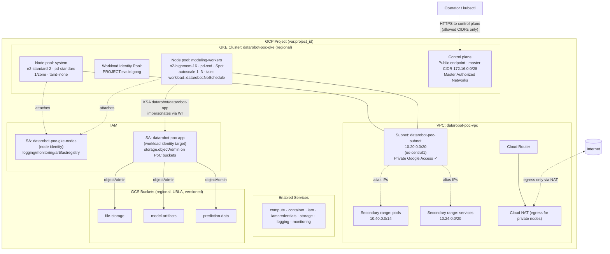

# Technical Architecture — Terraform

This document describes what `terraform/` provisions, how the pieces fit
together, and the security/identity boundaries between them. It mirrors
the resources in [terraform/main.tf](terraform/main.tf) — when that file
changes, update this doc.

---

## 1. High-level diagram



## 2. Resource inventory

| Layer | Terraform resource | Name pattern | Purpose |
|---|---|---|---|
| APIs | `google_project_service.services` | (7 APIs) | Enable compute, container, iam, iamcredentials, storage, logging, monitoring |
| Network | `google_compute_network.vpc` | `datarobot-poc-vpc` | Custom-mode VPC, regional routing |
| Network | `google_compute_subnetwork.subnet` | `datarobot-poc-subnet` | Primary `10.20.0.0/20` + secondary ranges for Pods/Services; Private Google Access on |
| Network | `google_compute_router.router` | `datarobot-poc-router` | Anchor for Cloud NAT |
| Network | `google_compute_router_nat.nat` | `datarobot-poc-nat` | Outbound internet for private GKE nodes |
| IAM | `google_service_account.gke_nodes` | `datarobot-poc-gke-nodes` | Identity attached to GKE node VMs |
| IAM | `google_project_iam_member.gke_nodes_roles` | (5 roles) | logWriter, metricWriter, monitoring.viewer, stackdriver.resourceMetadata.writer, artifactregistry.reader |
| IAM | `google_service_account.datarobot_app` | `datarobot-poc-app` | Target SA that DataRobot pods impersonate |
| IAM | `google_service_account_iam_member.workload_identity_binding` | — | Grants `roles/iam.workloadIdentityUser` to KSA `datarobot/datarobot-app` |
| Storage | `google_storage_bucket.blob` | `${PROJECT}-datarobot-poc-{file-storage,model-artifacts,prediction-data}` | DataRobot blob storage; UBLA, public-access blocked, versioned, 30-day non-current cleanup |
| Storage IAM | `google_storage_bucket_iam_member.datarobot_app_object_admin` | — | `storage.objectAdmin` on each bucket scoped to `datarobot-poc-app` |
| Cluster | `google_container_cluster.primary` | `datarobot-poc-gke` | Regional, VPC-native, public CP endpoint, private nodes, WI enabled, PD CSI on |
| Nodes | `google_container_node_pool.system` | `system` | e2-standard-2, pd-standard, 1/zone, no taint, secure boot |
| Nodes | `google_container_node_pool.workers` | `modeling-workers` | n2-highmem-16, pd-ssd, Spot, autoscale 1–3/zone, taint `workload=datarobot:NoSchedule`, single-zone via `node_locations` |

## 3. Network topology

- **Mode:** custom (no auto-subnets), single subnet in `var.region`.
- **CIDR plan**

  | Range | CIDR | Used by |
  |---|---|---|
  | Subnet primary | `10.20.0.0/20` | Node IPs |
  | Pods secondary | `10.40.0.0/14` | Pod alias IPs (VPC-native) |
  | Services secondary | `10.24.0.0/20` | ClusterIPs |
  | Master | `172.16.0.0/28` | GKE control plane peering (Google-managed) |

- **Egress:** nodes have no public IPs. Outbound traffic (image pulls,
  Helm repo fetches, GCS over public endpoint when WI uses external token
  exchange) leaves through Cloud NAT. Private Google Access lets API
  traffic to `*.googleapis.com` stay on Google's backbone.
- **Ingress:** the control plane has a public endpoint locked down by
  `master_authorized_networks_config` — only CIDRs in
  `var.master_authorized_cidrs` can reach `kubectl`. Workload ingress
  (the DataRobot UI) goes through a GCE L7 LB created by the chart's
  Ingress.

## 4. Identity model (Workload Identity)

```
KSA: datarobot/datarobot-app
   └── (annotation) iam.gke.io/gcp-service-account = datarobot-poc-app@…
        └── (binding) roles/iam.workloadIdentityUser
             └── GCP SA: datarobot-poc-app
                  └── roles/storage.objectAdmin on each PoC bucket
```

Two distinct service accounts on purpose:

1. **`datarobot-poc-gke-nodes`** is the *node* identity. It's attached to
   every VM in both pools and only carries platform roles (logging,
   monitoring, pulling images). DataRobot pods do **not** inherit its
   permissions because `workload_metadata_config.mode = GKE_METADATA`
   blocks the node SA from leaking into pods.
2. **`datarobot-poc-app`** is the *workload* identity. The DataRobot pod
   gets a short-lived token for this SA via the Workload Identity
   exchange. This SA is the only one with bucket-level permissions, and
   even then scoped to the three PoC buckets — not project-wide.

## 5. Compute / scheduling

- **Regional cluster, single-zone nodes.** `google_container_cluster.primary`
  is regional (control plane replicated across 3 zones for resilience),
  but `node_locations = ["us-central1-a"]` keeps the actual VMs in one
  zone to cut PoC cost by 3×.
- **Two pools, separated by taint.**
  - `system` — untainted, default landing pad for ingress, cert-manager,
    kube-system add-ons.
  - `modeling-workers` — tainted `workload=datarobot:NoSchedule`. Only
    pods that declare the matching toleration (set in
    `kubernetes/values-poc.yaml` under `global.modelingTolerations`) land
    here. This stops cheap system pods from squatting on expensive
    high-memory VMs.
- **Autoscaling.** Cluster autoscaler scales the worker pool 1–3 per
  zone. With Spot enabled (`var.worker_use_spot = true`) preemption can
  remove a node with 30s notice; the autoscaler will request a
  replacement.

## 6. Storage

| Component | Backing | Why |
|---|---|---|
| Stateful K8s services (Postgres, Mongo, ES, Redis) | `pd-ssd` via the `datarobot-ssd` StorageClass (applied separately in `kubernetes/storage-class.yaml`) | Random-IO heavy; SSD avoids latency cliffs |
| DataRobot blob storage | GCS regional buckets, accessed via Workload Identity | Object store is durable, cheap, and the chart supports it natively |
| Node boot disks (workers) | `pd-standard`, 100 GB | `pd-ssd`, `pd-balanced`, and `pd-extreme` all share the same `SSD_TOTAL_GB` quota (500 GB default). Boot disks don't need SSD; reserving the SSD quota for hot-path PVCs is more valuable. |
| Default pool (transient, deleted by `remove_default_node_pool`) | `e2-small` + 20 GB `pd-standard` | Without an explicit `node_config` on the cluster resource, GKE picks defaults that count against SSD quota and can fail bootstrap on a fresh project. |
| Node boot disks (system) | `pd-standard`, 100 GB | System pool doesn't need SSD |

Buckets have `force_destroy = true` for the PoC so `terraform destroy`
removes them cleanly. Flip to `false` before any non-PoC use.

## 7. Lifecycle / state

- **State backend:** local (`terraform.tfstate` in `terraform/`). Fine
  for a single-operator PoC; switch to a GCS backend (versioned bucket
  with object lifecycle) before more than one person runs `apply`.
- **Provider versions:** pinned to `hashicorp/google ~> 5.30` and
  `hashicorp/google-beta ~> 5.30` — `google-beta` is only used for the
  cluster resource so we can rely on beta-only knobs without dragging
  the rest of the stack onto the beta provider.
- **Required role to apply:** the operator needs at minimum
  `roles/compute.networkAdmin`, `roles/container.admin`,
  `roles/iam.serviceAccountAdmin`, `roles/resourcemanager.projectIamAdmin`,
  and `roles/storage.admin`. `roles/owner` covers all of these and is the
  pragmatic choice for a PoC project.
- **Destroy order:** Helm release → `terraform destroy`. The chart's
  GCE Ingress creates a forwarding rule outside Terraform's view; if you
  skip the Helm uninstall, `terraform destroy` will fail trying to
  delete the subnet because the LB's forwarding rule still references
  it.

## 8. What's *not* in Terraform (deliberate)

- **DataRobot Helm release.** Managed by `helm` directly so the operator
  can iterate on `values-poc.yaml` without round-tripping through
  Terraform. Could be moved to the `helm_release` provider if you want
  one-shot bring-up.
- **DNS.** No `google_dns_*` resources — point your existing record at
  the LB IP after the chart creates it.
- **TLS certificates.** Either provided as a K8s Secret out-of-band or
  issued by cert-manager. Keeping cert lifecycle out of Terraform avoids
  state churn on every renewal.
- **Secrets** (license, registry pull secret). Created with `kubectl
  create secret …` — never committed.
